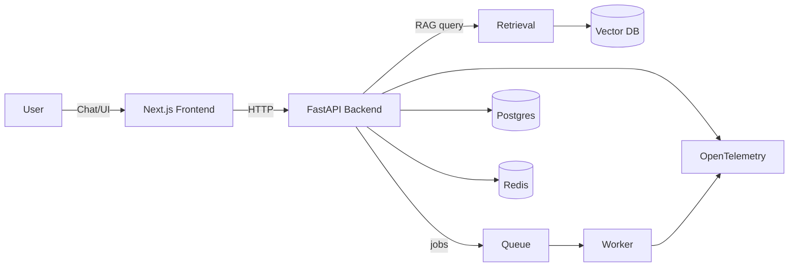

# ai-fullstack-agent-saas

Production-minded **AI full‑stack founder starter** (Python + TypeScript):

- **Backend:** FastAPI (Python)
- **Frontend:** Next.js (TypeScript)
- **Core:** Agent + RAG
- **Infra:** Postgres + Redis
- **Ops:** tracing/metrics, evals, CI, docker-compose

## Why this repo exists

This repo is designed to become an **industry-ready portfolio project**:

- clean architecture
- reproducible local dev
- measurable quality (evals)
- observability (traces/metrics)
- deployable shape (containers)

## Roadmap (v0)

1. **Scaffold**: monorepo layout, docker-compose, FastAPI + Next.js hello world
2. **RAG**: ingestion + retrieval + citations
3. **Agent**: tool calling, permissions, audit log
4. **Eval harness**: golden sets, regression checks in CI
5. **Observability**: OpenTelemetry traces + basic dashboard

## Architecture (high level)

## Getting started (soon)

This will be filled in as we scaffold the code.
