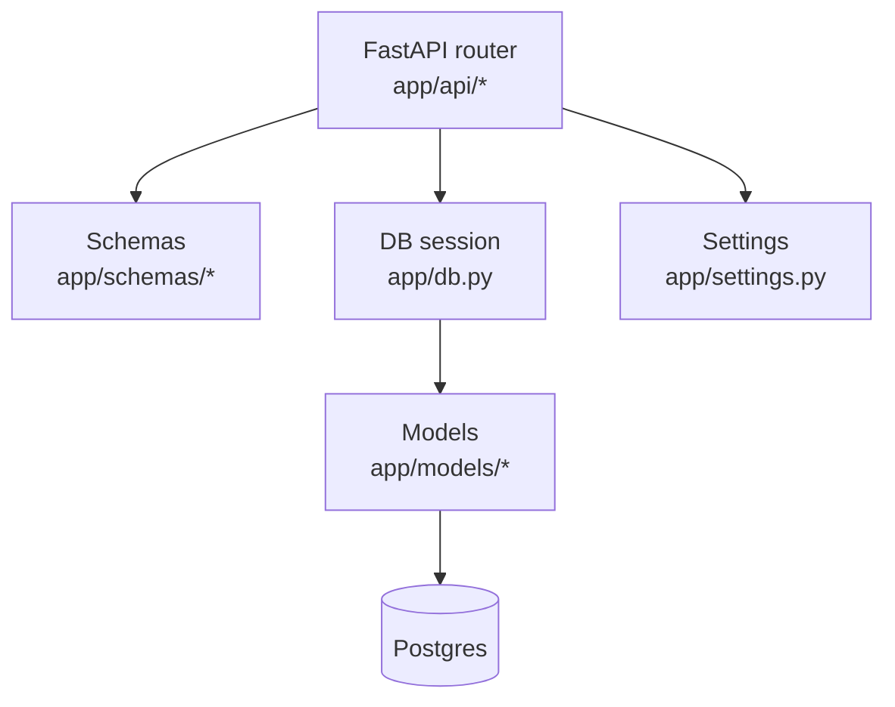
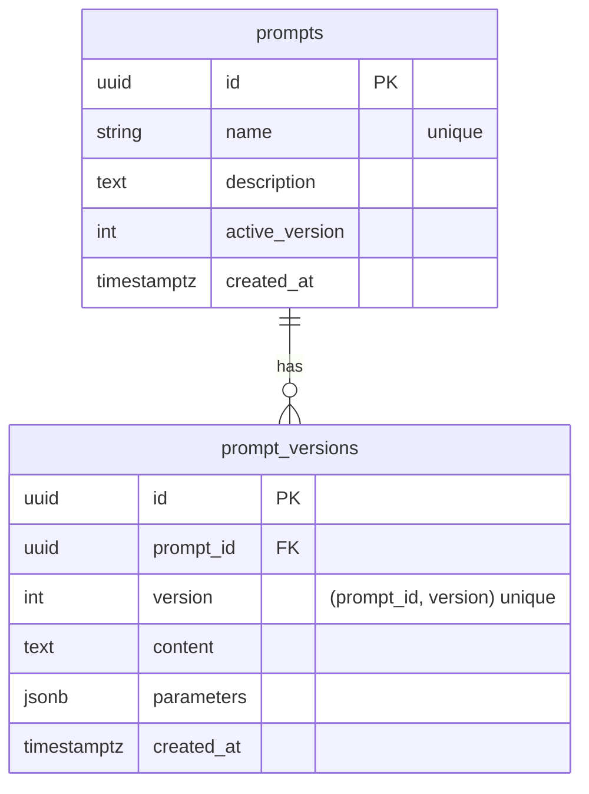
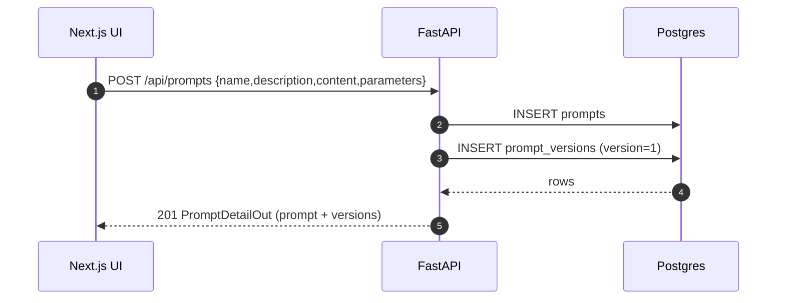

# Architecture

## Repo layout

- `backend/` — FastAPI service + Alembic migrations
- `frontend/` — Next.js UI
- `infra/` — local infrastructure (docker-compose)
- `docs/` — design docs & diagrams

## Runtime components (local dev)

```mermaid
flowchart LR
  U[User/Developer] --> FE[Next.js (frontend)]
  FE --> API[FastAPI (backend)]
  API --> PG[(Postgres)]

  subgraph Local Dev (docker-compose)
    API
    PG
  end

  subgraph Local Dev (host machine)
    FE
  end
```

## Backend structure

The backend is intentionally layered so we can grow into runs/traces/evals without turning into a ball of mud.



## Data layer

- Postgres is the system of record.
- Alembic manages schema migrations.
- `infra/docker-compose.yml` provides a consistent local environment.

### Prompt Registry (v0)

#### API (v0)

- `POST /api/prompts` → create prompt + version 1
- `GET /api/prompts?q=&limit=&offset=` → list prompts (includes latest version; supports simple search + pagination; implemented as a single join query to avoid N+1)
- `GET /api/prompts/{prompt_id}` → prompt detail w/ versions
- `PATCH /api/prompts/{prompt_id}` → update prompt metadata
- `POST /api/prompts/{prompt_id}/versions` → create new version (allocates next sequential version; DB-enforced uniqueness with retry on concurrent writes)
- `POST /api/prompts/{prompt_id}/activate` → set the prompt’s `active_version` (promotion/rollback)
- `DELETE /api/prompts/{prompt_id}` → delete prompt (cascades versions)

#### UI routes (v0)

- `/prompts` → list prompts (shows latest version snippet)
- `/prompts/new` → create prompt (creates v1)
- `/prompts/{prompt_id}` → prompt detail + versions list + create new version + delete prompt

We store immutable prompt *versions* under a stable prompt identity:



#### Create flow (v0)



Planned next entities:
- runs (per execution)
- spans/traces (observability)
- eval datasets + results
