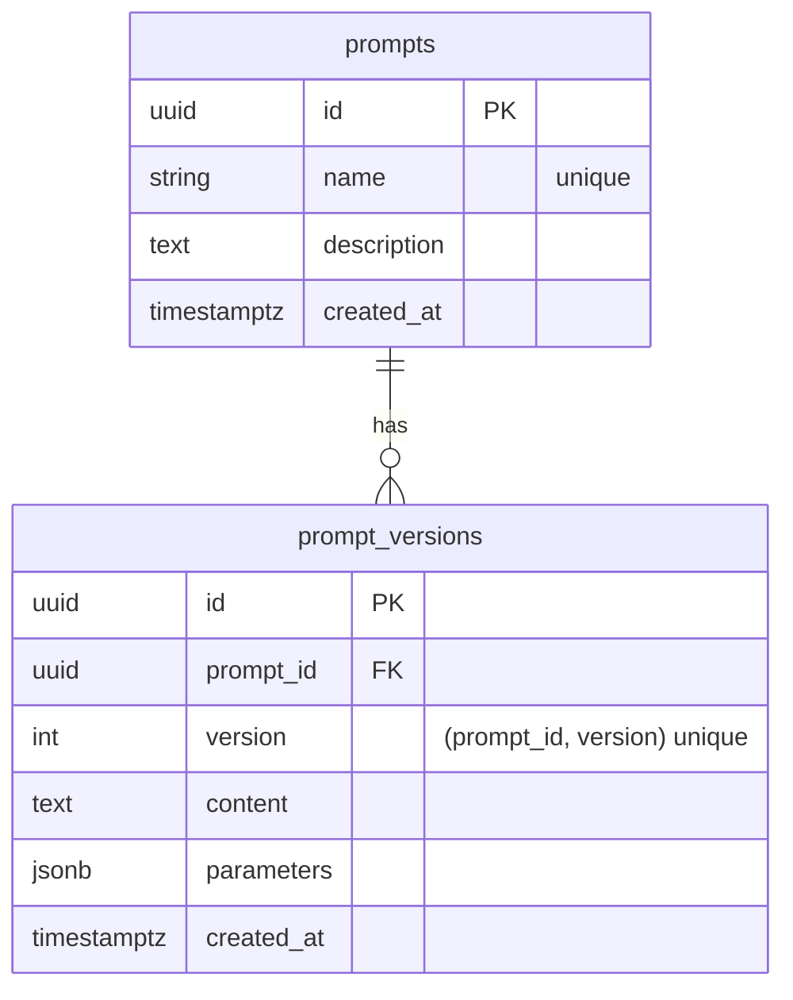

# Architecture

## Repo layout

- `backend/` — FastAPI service + Alembic migrations
- `frontend/` — Next.js UI
- `infra/` — local infrastructure (docker-compose)
- `docs/` — design docs & diagrams

## Runtime components

```mermaid
flowchart LR
  U[User/Developer] --> FE[Next.js (frontend)]
  FE --> API[FastAPI (backend)]
  API --> PG[(Postgres)]

  subgraph Local Dev
    FE
    API
    PG
  end
```

## Data layer

- Postgres is the system of record.
- Alembic manages schema migrations.

### Prompt Registry (v0)

We store immutable prompt *versions* under a stable prompt identity:



Planned next entities:
- runs (per execution)
- spans/traces (observability)
- eval datasets + results
